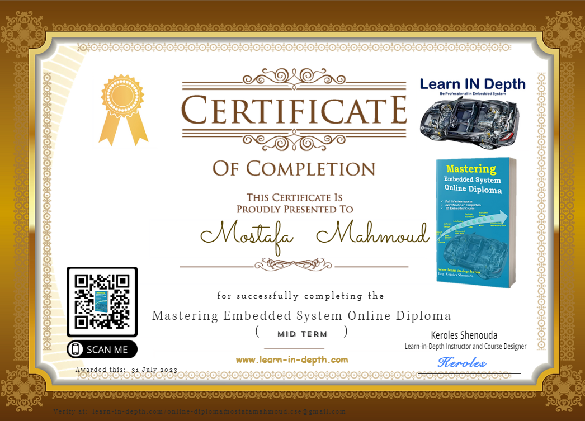

# Embedded_Systems_Online_Diploma

## Contents

### First Term 

- [Unit 1: Diploma Prerequisites](https://github.com/mostsfamahmoud/Embedded_Systems_Online_Diploma/tree/main) 
- [Unit 2: C Programming](./Unit%202%20(C%20Programming)) 
- [Unit 3: Embedded C](./Unit%203%20(Embedded%20C)) 
- [Unit 4: System Architect](./Unit%204%20(System%20Architect)) 
- [Unit 5: First Term Projects](Unit_5_First_Term_Projects) 

---

## My Progress Page: [Click Here](https://www.learn-in-depth.com/online-diploma/mostafamahmoud.cse%40gmail.com)

---

## My Drive [Assignments + Quizzes]: [Click Here](https://drive.google.com/drive/folders/1zySA9ZycSBvmleGIKktQHc8bNaS-A1ic?usp=sharing)

---

## Overall progress 

